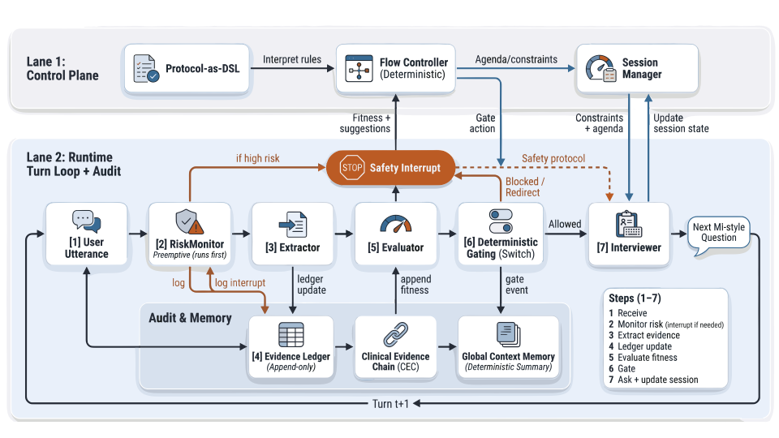
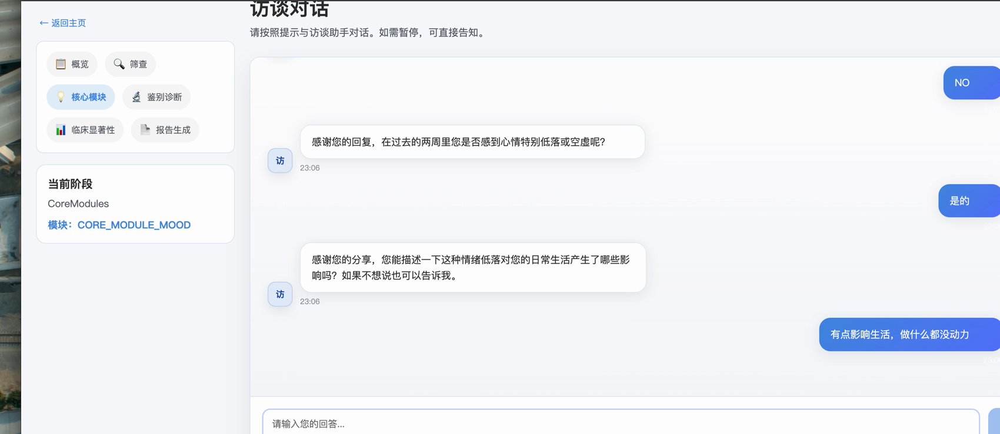
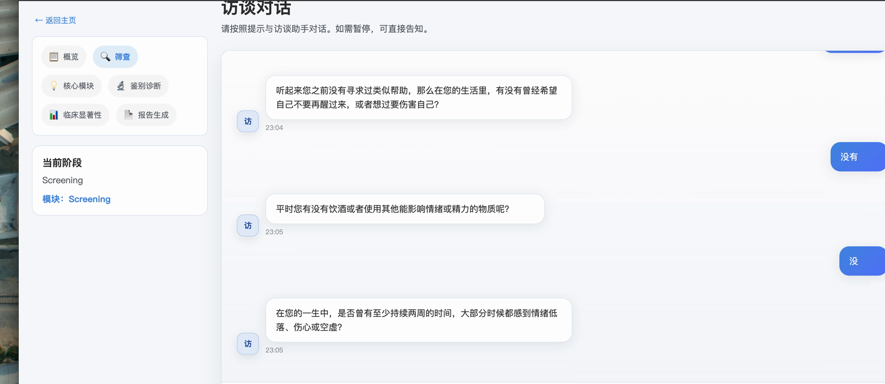
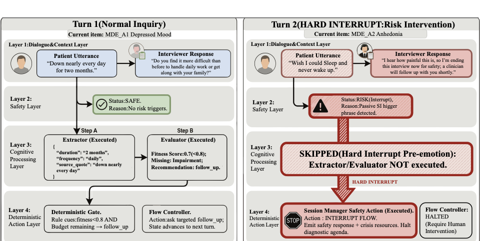

# scid-agent-showcase

A controllable LLM-agent workflow for high-risk structured clinical interviewing, packaged as a public engineering showcase with synthetic configs and replay examples.

> Public showcase only. This repository is not a clinical diagnostic tool or medical device.



This repository highlights:
- Flow-controlled orchestration for structured interview phases and module progression
- Risk-aware interruption, trace logging, and replayable session review
- A paper-backed system subset that stays inspectable without private data or unpublished assets

**Demo:** [Watch 60s demo](docs/demo/scid-demo-60s.mp4) · [Read architecture notes](docs/architecture.md) · [Run the showcase](#quickstart)

## Overview

`scid-agent-showcase` is the public-facing subset of a larger research prototype for structured clinical interviewing. The code here is intentionally narrowed to the parts that are most useful for engineering review: interview flow control, schema-backed evidence collection, structured logging, transcript replay, and compact report reconstruction.

Everything included in this repository is synthetic or safe to share. Private prompts, unpublished evaluation assets, real data, and internal experiment materials are intentionally excluded.

## Interface

| Core module dialogue | Structured screening |
| --- | --- |
|  |  |

- The dialogue surface makes phase progression readable instead of hiding workflow decisions behind a generic chat shell.
- The screening view shows how structured yes/no turns map cleanly to controlled state transitions.
- These screenshots come from the runnable demo layer used in the portfolio and paper appendix workflow.

## System Design


The public subset is centered around four inspectable areas:
- [`server/orchestrator/flow_controller.py`](server/orchestrator/flow_controller.py): deterministic phase, module, and transition logic
- [`packages/schemas/`](packages/schemas): structured extraction contracts and JSON schema export
- [`server/utils/logger.py`](server/utils/logger.py): event logging and trace-friendly instrumentation
- [`server/services/transcript_importer.py`](server/services/transcript_importer.py) and [`server/services/report_service.py`](server/services/report_service.py): replay import and compact report reconstruction

## Evaluation / Replay



- Risk-first checks can interrupt or skip unsafe branches before continuing the workflow.
- Session actions and structured logs make behavior reviewable across workflow versions.
- Replay and report reconstruction turn long dialogue traces into inspectable engineering artifacts instead of one-off demos.

## What I Built

- Workflow and state-machine design for phase transitions, module activation, and failure handling
- Schema design for evidence collection, extraction contracts, and exportable JSON schemas
- Replay, logging, and report-packaging paths for inspectable end-to-end review
- Public showcase packaging, documentation, and runnable examples for hiring and collaboration review

## Public Scope

Included here:
- Safe-to-share orchestration, schema, logging, and replay code
- Synthetic workflow definitions and toy transcript assets
- Lightweight tests and example runners for fast inspection

Intentionally excluded:
- Real or sensitive data
- Private prompts, keys, local environment files, and unpublished paper assets
- Large internal logs, unreviewed outputs, and deployment leftovers

## Quickstart

```bash
python -m venv .venv
source .venv/bin/activate
pip install -r requirements.txt

python -m packages.schemas.export --check
pytest
python examples/run_showcase.py
```

Useful files:
- [docs/architecture.md](docs/architecture.md)
- [docs/public_release_manifest.md](docs/public_release_manifest.md)
- [config.example.yaml](config.example.yaml)
- [.env.example](.env.example)
- [CONTRIBUTING.md](CONTRIBUTING.md)

## Repository Guide

```text
packages/schemas/        Schema models, registry, and schema export
server/orchestrator/     Flow controller, events, session state
server/services/         Workflow loading, question repo, replay/report helpers
server/utils/            Logging utilities
configs/                 Synthetic workflow, toy questions, JSON schemas
examples/                Replay transcript and demo runner
docs/                    Architecture and public release notes
tests/                   Minimal behavior checks for the showcase subset
```
