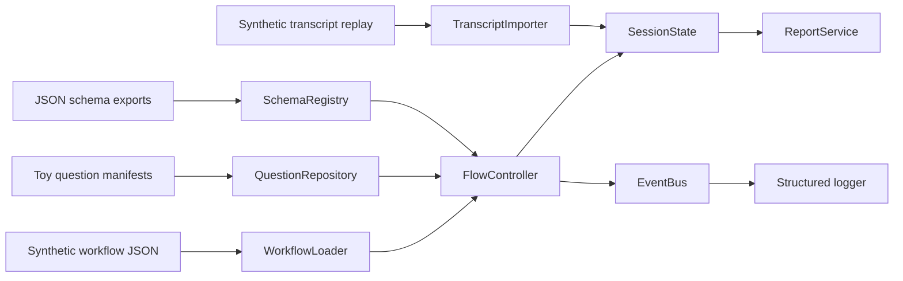

# Architecture

This public repo keeps the engineering skeleton of the SCID research prototype while replacing the private study assets with synthetic configuration and toy transcripts.

## Component View

## Interview Phase Skeleton

## Public Design Choices

- The flow controller remains deterministic so interviewers can inspect phase progression and retry logic without hidden prompt behavior.
- Schema exports remain in the repo so the structured contracts are visible and testable.
- Replay is file-based and synthetic, which makes trace reconstruction inspectable without exposing real transcripts.
- The question manifests are intentionally small and synthetic; they illustrate orchestration shape, not the full unpublished research inventory.
